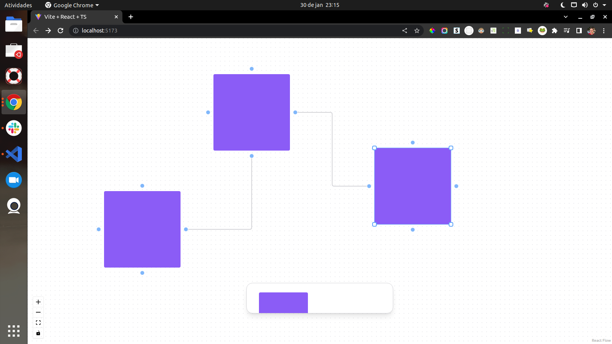

<h1 align="center">UI WHITEBOARD JAM</h1>

UiWhiteboard Jam é uma ferramenta de colaboração em quadro branco que você e sua equipe podem usar para criar ideias e organizá-las. Não é necessário ter conhecimento prévio de ferramentas de design para começar a colaborar.

UiWhiteboard fornece ambientes leves e inclusivos em que qualquer pessoa pode participar. Pense neles como quadros brancos digitais onde você e sua equipe descobrem e exploram ideias.

<h2 align="center">Brainstorm e explore ideias</h2>

Crie árvores de decisão, diagramas e mapas mentais

Realize críticas ou sessões de feedback sobre designs

Colete ideias, anote feedback e organize pesquisas

Planeje e realize reuniões, tutoriais ou outras sessões interativas.

 <a href="#objetivo">Objetivo</a> •
 <a href="#tecnologias">Tecnologias</a> •
 <a href="#como-rodar">Como rodar</a> •
 <a href="#autor">Autor</a>

<h2 align="center" id="tecnologias">🛠 Tecnologias</h2>

As seguintes ferramentas foram usadas na construção do projeto:
  
<a href="https://pt-br.reactjs.org">React</a>

  
<a href="https://www.typescriptlang.org/">Typescript</a>

  
<a href="https://reactflow.dev/">ReactFlow</a>

  
<a href="https://vitejs.dev/">Vite</a>

  
<a href="https://tailwindui.com/">TailwindCSS</a>

  
<a href="https://www.radix-ui.com/">Radix</a>

<h2 align="center" id="como-rodar">Como Rodar</h2>

<pre class="notranslate" style="position: relative;"><code>Clone este repositório
 $ git clone <git@github.com:fcrfabiano/ui-whiteboard-jam.git>

  Acesse a pasta do projeto no terminal/cmd
  $ cd ui-whiteboard-jam

  Instale as dependências
  $ npm install

  Execute a aplicação em modo de desenvolvimento
  $ npm run dev

  Acesse <http://localhost:5173/>
</code>

</pre>

    <clipboard-copy aria-label="Copy" class="ClipboardButton btn js-clipboard-copy m-2 p-0 tooltipped-no-delay" data-copy-feedback="Copied!" data-tooltip-direction="w" value="docker-compose up -d" tabindex="0" role="button">
      <svg aria-hidden="true" height="16" viewBox="0 0 16 16" version="1.1" width="16" data-view-component="true" class="octicon octicon-copy js-clipboard-copy-icon m-2">
    <path fill-rule="evenodd" d="M0 6.75C0 5.784.784 5 1.75 5h1.5a.75.75 0 010 1.5h-1.5a.25.25 0 00-.25.25v7.5c0 .138.112.25.25.25h7.5a.25.25 0 00.25-.25v-1.5a.75.75 0 011.5 0v1.5A1.75 1.75 0 019.25 16h-7.5A1.75 1.75 0 010 14.25v-7.5z"></path><path fill-rule="evenodd" d="M5 1.75C5 .784 5.784 0 6.75 0h7.5C15.216 0 16 .784 16 1.75v7.5A1.75 1.75 0 0114.25 11h-7.5A1.75 1.75 0 015 9.25v-7.5zm1.75-.25a.25.25 0 00-.25.25v7.5c0 .138.112.25.25.25h7.5a.25.25 0 00.25-.25v-7.5a.25.25 0 00-.25-.25h-7.5z"></path>
</svg>
      <svg aria-hidden="true" height="16" viewBox="0 0 16 16" version="1.1" width="16" data-view-component="true" class="octicon octicon-check js-clipboard-check-icon color-fg-success d-none m-2">
    <path fill-rule="evenodd" d="M13.78 4.22a.75.75 0 010 1.06l-7.25 7.25a.75.75 0 01-1.06 0L2.22 9.28a.75.75 0 011.06-1.06L6 10.94l6.72-6.72a.75.75 0 011.06 0z"></path>
</svg>
    </clipboard-copy>
  

  <h1 align="center">
  
  
</h1>
<h2 align="center" id="autor">Criado com ❤️ por Fabiano</h2>
